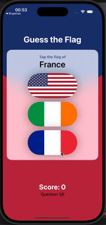

# 🎌 GuessTheFlag - 100 Days of SwiftUI Solution  

Solution to the **[Guess The Flag challenge from 100 Days of SwiftUI](https://www.hackingwithswift.com/books/ios-swiftui/guess-the-flag-wrap-up)**.

---

## 📑 Table of Contents  
- [About this project](#about-this-project)
- [Preview](#preview)
- [Technologies](#technologies)
- [Learning Experience](#learning-experience)
- [Author](#author)

---

### About This Project  
**Guess The Flag** is a native iPhone guessing game designed to help users recognize and learn the flags of different countries. Built entirely with **SwiftUI**, it provides a fun and interactive way to test flag knowledge.

## 📌 Features & Concepts Used:  
- **Using stacks** to arrange views  
- **Colors, frames, and gradients** for styling  
- **Buttons and images** for user interaction  
- **Showing alert messages** for feedback  
- **Displaying player scores** in alerts  
- **Game logic:** tracking and updating scores  
- **Randomizing flag choices** while avoiding repeats  
- **Game lifecycle:** ending and restarting the game  

---

## 🎯 The Challenge  
Users should be able to:  
✅ Select from **three** different country flags per round  
✅ Get an alert and **increase their score** when they answer correctly  
✅ Get an alert and **decrease their score** when they answer incorrectly  
✅ **Never score below zero** (no negative scores)  
✅ Play a maximum of **10 rounds per game**  
✅ Restart the game once it ends  

---

### Preview  

 

---

### Technologies  
**Languages & Tools:**  
- Swift  
- SwiftUI  
- Git  

---

### Learning Experience  
This project helped me solidify my understanding of basic SwiftUI concepts, including:  
- Stacks
- Colors/Gradients
- Buttons  
- Images
- Alerts  
- Asset catalogs  

---

### Author  
- **GitHub:** [@Aysledger](https://github.com/Aysledger)  
- **100 Days of SwiftUI:** [@twostraws](https://twitter.com/twostraws)  
